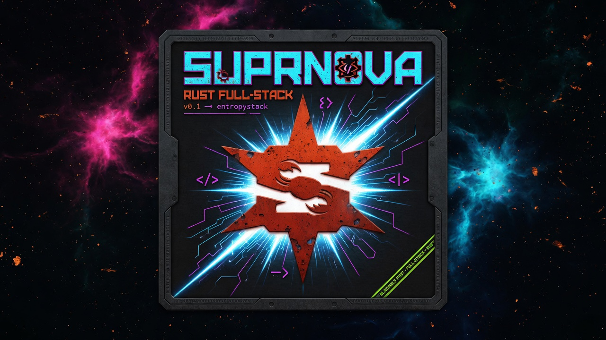

# Nebula

Nebula is [Suprnova](https://github.com/entrepeneur4lyf/suprnova)'s Tier-1
starter kit — the Breeze equivalent. It gives a new app a complete,
production-shaped account story on day one:

- **Registration with email verification** — register, get a verification
  link by mail, and verified-only routes stay locked until it's clicked.
  The consume endpoint is public by design, so a link opened on a
  logged-out device still verifies.
- **Login with remember-me**, logout, and guest/auth/verified route gates.
- **Password reset** — request a link, set a new password. The request
  endpoint is anti-enumeration: it answers identically whether or not the
  address is registered.
- **Profile management** — update name/email (changing the email re-triggers
  verification), change password, delete the account.
- **A branded frontend** — Inertia 3 + Svelte 5 (runes) + sv5ui, dark by
  default, with the Nebula icon set served at the web root.

The backend is Rust on Suprnova; the frontend is a Vite + Tailwind v4 SPA
bridged over Inertia. Everything below is wired and tested — clone it,
rename it, build your app on top.

## Quickstart

You'll need Rust (stable), Node 20+, and the Suprnova CLI:

```bash
cargo install --git https://github.com/entrepeneur4lyf/suprnova.git suprnova-cli
```

Then:

```bash
git clone <your-fork-of-this-kit> my-app
cd my-app
cp .env.example .env
suprnova serve
```

`suprnova serve` installs the frontend dependencies, starts the Rust
backend on `http://localhost:8080` (migrations run automatically against
the SQLite database) and Vite on `:5173`, and watches both. Open
**http://localhost:8080** — the page origin is always the Rust server;
Vite only supplies JS/CSS.

Prefer raw cargo? `cargo run --bin nebula -- serve` runs the backend
alone; pair it with `npm run dev` in `frontend/`.

### Your first registration

1. Visit `/register` and create an account. You'll land on the
   verify-email notice — the dashboard is gated until you verify.
2. The kit ships with `MAIL_DRIVER=log`, so the verification email is
   written to the server console instead of being sent. Look for the
   `mail (log driver): would send` line — its `text` field carries the
   full message, including the link:

   ```
   INFO ... mail (log driver): would send from=hello@nebula.test to=["you@example.com"]
        subject=Verify your email for Nebula html=… text=Hi there, Welcome to Nebula.
        Please confirm your email address by visiting:
        http://localhost:8080/verify-email/verify?token=…
   ```

3. Open that URL — you're verified and redirected to `/dashboard`.

Password reset works the same way: request a link on `/forgot-password`
and pull the reset URL out of the console.

## Mail

Development defaults (from `.env.example`):

```dotenv
MAIL_DRIVER=log
MAIL_FROM="hello@nebula.test"
```

The `log` driver prints every outgoing message (envelope + rendered text
body) to the console and discards it — zero setup, links included. To see
real emails in a real inbox during dev, run
[Mailpit](https://github.com/axllent/mailpit) and swap:

```dotenv
MAIL_DRIVER=smtp
MAIL_HOST=localhost
MAIL_PORT=1025
```

For production, point the same SMTP variables at your provider (with
`MAIL_USERNAME` / `MAIL_PASSWORD`), or use one of Suprnova's HTTP
transports (Postmark, SES, SendGrid, Mailgun, Resend) via `MAIL_DRIVER`.
`MAIL_FROM` is required whenever verification or reset mail is sent — the
flows fail fast on a missing sender rather than minting orphan tokens.

## APP_URL

Verification and reset links are built from `APP_URL`, not from the
incoming request — keep it in sync with how you actually reach the app
(default `http://localhost:8080`, matching `SERVER_PORT`). If you serve
the kit on a named TLS dev URL via `suprnova dev:tls`, set
`APP_URL=https://<name>.localhost` so emailed links land on the right
origin.

## Make it yours

**Brand assets.** The icon set lives in the top-level `public/` directory
(`favicon.ico`, the PNG sizes, `apple-touch-icon.png`,
`site.webmanifest`). Replace those files with your own and the whole app
follows — the tags that reference them are in
`frontend/src/lib/Layout.svelte`.

**Colors.** The UI is sv5ui on Material-Design-3 OKLCH tokens.
`frontend/src/app.css` overrides a handful of them under `:root`
(`--color-primary`, `--color-on-primary`, `--color-primary-container`,
`--color-on-primary-container`, `--color-tertiary`). Tune those values to
restyle every component at once — no per-component theming needed.

**Root-served static files.** Suprnova routes everything — there is no
implicit public directory, by design. The kit's pattern for files browsers
request at the web root is `src/controllers/static_files.rs`: a
`content_type` match that doubles as a whitelist, plus one explicit route
per asset in `src/routes.rs`. To serve a new root-level file, add one
match arm and one `get!` route. Anything not whitelisted is refused even
if a matching file exists under `public/`, so the handler can never be
pointed at an unexpected path. The same handler runs in dev and prod.

**Head and meta.** Inertia's Svelte adapter uses Svelte's native
`<svelte:head>`. The app-wide defaults (title, icon links, manifest) are
in `frontend/src/lib/Layout.svelte`; any page can override the title with
its own `<svelte:head><title>` block, as `Home.svelte` does.

## Testing

```bash
cargo test
```

Two complementary suites cover the account flows end-to-end:

- **`tests/auth_flows.rs` (facade level)** exercises the flow *logic* —
  token mint/consume, verification stamping, password rotation,
  anti-enumeration — against a real in-memory database with the mail
  transport faked. Tokens are extracted from the captured mail bodies and
  assertions read the persisted rows back through the same user provider
  the app registers.
- **`tests/http_flows.rs` (request path)** drives the kit's *wiring* —
  the real route table, the guest/auth/verified middleware gates,
  session-cookie continuity, CSRF round-trips, and the real
  PATCH/PUT/DELETE verbs — through Suprnova's `handle_request` over a
  loopback socket, exactly like the framework's own integration
  harnesses.

A failure in the first suite points at flow logic; a failure in the
second points at HTTP wiring.
